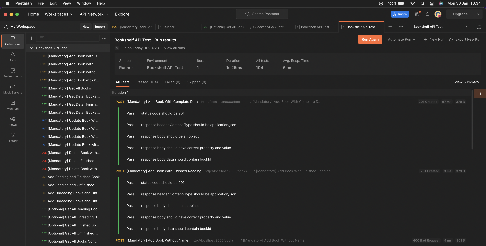

# dc-books-api
Build API using Hapi Framework. Dicoding Submission

## Running Project

```shell
npm intsall
npm run start //to running app
npm run start-dev //to running app on development purposes
```

## Test Project
Import collection and environment to postman tool.
`Bookshelf API Test.postman_collection.json`
`Bookshelf API Test.postman_environment.json`

change environment to `Bookshelf API Test`

Run the test.

